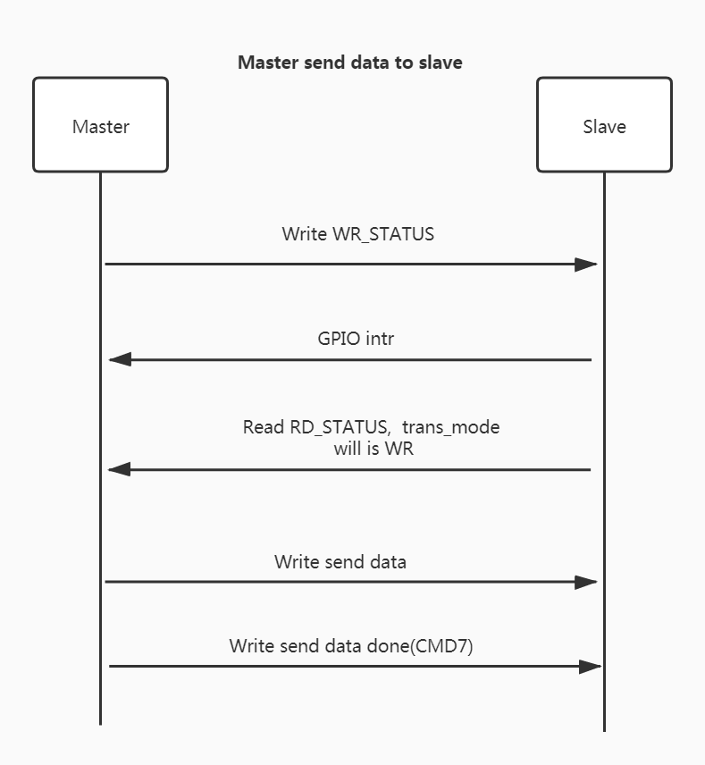
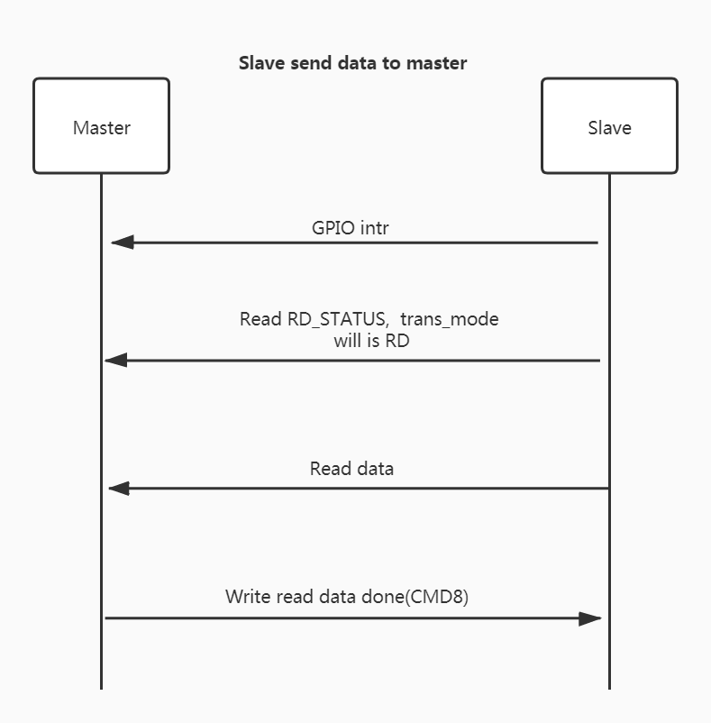

## Overview

ESP32-x series SPI VFS encapsulates the interactive protocol layer based on the ESP32-x series (including ESP32-C series and ESP32-S series, but not ESP32) driver interface, and encapsulates the upper layer into standard POSIX file operation interfaces. It can meet the requirement of efficient data transmission with MCU under various applications.

## Hardware Connection

| Signal      | Master(ESP32) | Slave(ESP32-C3) | Slave(ESP32-S2) |
| ----------- | ------------- | --------------- | --------------- |
| SCLK        | GPIO15        | GPIO6           | GPIO12          |
| MISO        | GPIO12        | GPIO2           | GPIO13          |
| MOSI        | GPIO13        | GPIO7           | GPIO11          |
| CS          | GPIO14        | GPIO10          | GPIO10          |
| HANDSHAKE   | GPIO5         | GPIO3           | GPIO5           |
| GND         | GND           | GND             | GND             |
| WP(Quad SPI) | GPIO16        | GPIO8           | GPIO16          |
| HD(Quad SPI) | GPIO17        | GPIO9           | GPIO17          |

**Note:**  

1. Quad SPI mode needs two extra IOs, WP pin and HD pin.

## Transmission Protocol

In general, traditional SPI slave only provides SPI read and write APIs, because according to the SPI protocol, the SPI master needs to actively initiate communication. But in many cases, SPI slave needs to be able to notify the SPI master to read data sent from the SPI slave, so the encapsulated transmission protocol mainly implements the two-way SPI transmission and solves the problems that arise.

The principle of this transmission protocol is that SPI slave controls the communication, and the SPI master initiates transmission according to the communication mode set by the SPI slave.

ESP32-x series chips has 72 bytes of shared registers for SPI master to visit. The first 8 bytes are used for transmission control in the transmission protocol.

- The first 4 bytes are called `RD_STATUS`, and the SPI master reads the `RD_STATUS` register to obtain status information such as data length, sequence number, and transmission direction.

- The last 4 bytes are called `WR_STATUS`, and the SPI master writes the `WR_STATUS` register to tell the SPI slave the sequence number and data length to be transmitted.

### MCU sends data to ESP32-x series

#### Workflow of MCU sending data

1. If MCU has data to send, to avoid simultaneous transmission, it needs to detect whether the SPI is busy or not firstly, and the MCU must wait for the completion of previous transmission to start a new transmission.
2. The MCU writes the sequence number and data length to be sent this time into the `WR_STATUS` register. If it is the first packet of data, the sequence number is 1, otherwise it needs to be incremented according to the last sequence number, and then wait for the interrupt of HANDSHAKE pin.
3. MCU writing the `WR_STATUS` register will trigger the ESP32-x chip to generate an event. After the ESP32-x chip detects the event, it will write the received sequence number and data length intactly to the RD register, mark the transmission direction as `WRITE`, and then mount a buffer of the corresponding data length to the SPI RX DMA to receive data, and then raise the HANDSHAKE pin to notify the MCU.
4. After the MCU gets the HANDSHAKE interrupt, it will first read the `RD_STATUS` register. The MCU needs to verify whether the sequence number and data length are the same as those previously written, and determine whether to send or receive data by reading the transmission direction. The transmission direction read at this time is `WRITE`.
5. The MCU sends data of the corresponding length, and then sends CMD7 to indicate that the data transmission completed.

### ESP32-x series send data to MCU

The sending process of ESP32-x series is basically similar to that of MCU sending.

1. If ESP32-x chip has data to send, to avoid simultaneous transmission, it needs to detect whether the SPI is busy or not firstly, and the ESP32-x chip must wait for the completion of previous transmission to start a new transmission.
2. The ESP32-x chip loads data to the SPI TX DMA, writes the sequence number, transmission direction(`READ` in this case), and data length into the RD register. If it is the first packet of data, the sequence number is 1, otherwise it needs to be incremented according to the last sequence number.
3. The ESP32-x series notify the MCU by HANDSHAKE pin.
4. After the MCU gets the HANDSHAKE interrupt, it reads the data length information and transmission direction (which should be `READ` in this case) in the RD_STATUS register. And the MCU also needs to check whether the current sequence number is the saved previous sequence number plus one.
5. The MCU starts SPI read data transmission, and then sends CMD8 to indicate that the data transmission completed.

### HANDSHAKE Pin

The HANDSHAKE pin is to avoid the MCU initiating the SPI transmission when the data is not ready on ESP32-x side, resulting in data loss. After the ESP32-x series load data to the corresponding DMA, the SPI transmission can be controlled by pulling up the HANDSHAKE pin, and the MCU needs to monitor the rising edge interrupt of HANDSHAKE pin. 

- ESP32-x series to send data, MCU to receive data
  - When the ESP32-x chip is going to send data, it will first mount the data buffer to the DMA, and then pull the HANDSHAKE pin to high level. After receiving the HANDSHAKE interrupt signal, the MCU reads the `RD_STATUS` register and detects that the transmission direction is RD before the MCU can initiate a read data transfer.
- MCU to send data, ESP32-x series to receive data
  - When the MCU is going to send data, it must first write data length information to `WR_STATUS` register, and then wait for the HANDSHAKE interrupt after ESP32-x series to mount the read buffer to the DMA. After the MCU receives the HANDSHAKE interrupt signal, it checks the `RD_STATUS` register, only when the transmission direction is WR can a write data transmission be initiated.

### SPI Transmission Commands

When the MCU communicates with the ESP32-x series, it adopts a half-duplex mode. The MCU uses different commands and addresses to read or write data.

When reading and writing data, the communication format should be 1byte CMD + 1byte ADDR + 1byte DUMMY + read/write DATA (maximum is 4092bytes).

The detailed data format is as follows:

|            | Cmd（1byte） | Addr（1byte） | Dummy（1byte） | Data（Up to 4092bytes） |
| :--------: | :----------: | ------------- | -------------- | ----------------------- |
| Read data  |     0x4      | 0x0           | 0x0            | Actual data          |
| Write data |     0x3      | 0x0           | 0x0            | Actual data          |

After the reading/writing of data is completed, a reading/writing completion flag needs to be transmitted before the next transmission. The format of the reading and writing completion flags are as follows:

|            | Cmd（1byte） | Addr（1byte） | Dummy（1byte） |
| :--------: | :----------: | ------------- | -------------- |
| Read done  |     0x8      | 0x0           | 0x0            |
| Write done |     0x7      | 0x0           | 0x0            |

The communication formats for MCU to read and write `RD_STATUS` and `WR_STATUS` registers are as follows.

| Register       | Cmd（1byte） | Data Length（4byte）                          |
| ------------ | ------------- | ------------------------------------------ |
| Read RD_STATUS | 0x4           | MCU reads data length and control information transmitted by ESP32-x series |
| Write WR_STATUS | 0x1           | MCU writes data length and control information  |

Commands are transmitted on the MOSI line, and when the RD register is read, the data length is transmitted on the MISO line.

**Notice**：MCU reading and writing status does not need to use address bits, so it is necessary to distinguish reading and writing registers from reading and writing data in MCU development.

**WR_STATUS Register**

`WR_STATUS` register interface structure is as following table:

| Length Range (bit) | 31：24      | 23：16             | 15 ： 0                |
| --------------- | ----------- | ------------------ | ---------------------- |
| Function        | Magic       | Send sequence      | Send len               |
| Description     | 0xFE        | MCU increments every time it sends a package | The byte length of current data packet sent by MCU |

The send sequence needs to be incremented each time the MCU sends a packet. The send sequence is 1 when the MCU sends the first packet. When it exceeds 0xFF, the "send sequence" of the next packet should be 0.

**RD_STATUS Register**

The `RD_STATUS` register is responsible for negotiating the communication during transmission, so its content has different meanings when the MCU reads data and writes data.

`RD_STATUS` register interface structure is as following table:

| Length Range (bit) | 31：24 | 23：16           | 15 ： 0            |
| --------------- | ------ | ---------------- | ------------------ |
| Function        | Direct | Sequence number  | Transmit len       |
| MCU -> ESP      | WRITE  | Sequence number of the packet sent by MCU | Byte length of the packet sent by MCU |
| ESP -> MCU      | READ   | Sequence number of the packet sent by ESP | Byte length of the packet sent by ESP |

1. When the MCU sends data, it will write `WR_STATUS` first. The ESP32-x series will write the received `sequence` and `len` into `RD_STATUS`, prepare a buffer to receive data, and mark the transmission direction as `WRITE`. When the direction is `WRITE`, the MCU needs to check whether the sequence number in `RD_STATUS` is the same as the one sent by itself. Only if the sequence number is correct, the MCU can send the data. 
2. When ESP32-x chip sends data, it will also write the sequence number and data length first, and the identification direction is `READ`. The sequence number is incremented each time the ESP32-x chip sends a packet, and it is just like the send sequence, the sequence number is 1 when it sends the first packet, and when the sequence number is 0xFF, the sequence number of the next packet is 0.
3. Direct value: READ is 1, WRITE is 2.

> Notice: Please distinguish MCU sequence number from ESP32-x series sequence number, MCU needs to save both sequence numbers at the same time.

## Transmission Test Results

ESP32 runs as a SPI master, as the host MCU, its configuration is as: CPU 240M, QIO 40M, streambuffer is 8192. 

ESP32-C3 runs as a SPI slave, its configuration is as: CPU 160M, application sends 2048bytes per packet, streambuffer is 8192. 

ESP-IDF version: v4.3-beta1, commit: 52f1f68dc

The test results of different SPI clock is as the following table.

| Clock | Mode     | Master -> Slave | Slave -> Master |
| ----- | -------- | --------------- | --------------- |
| 10M   | Standard | 8.7Mbps         | 8.8Mbps         |
| 10M   | Dual     | 16.1Mbps        | 16.4Mbps        |
| 10M   | Quad     | 27.8Mbps        | 28.9Mbps        |
| 20M   | Standard | 16.2Mbps        | 16.5Mbps        |
| 20M   | Dual     | 28.0Mbps        | 29.1Mbps        |
| 20M   | Quad     | 44.4Mbps        | 47.2Mbps        |
| 40M   | Standard | 28.1Mbps        | 29.2Mbps        |
| 40M   | Dual     | 44.6Mbps        | 47.4Mbps        |
| 40M   | Quad     | 57.6Mbps        | 68.8Mbps        |

Notes:

1. When ESP32 runs as a SPI master for high-speed transmission (the rate is more than 20M), `gpio_matrix` cannot be used to select other pins for communication, otherwise the problem of data offset may occur.
