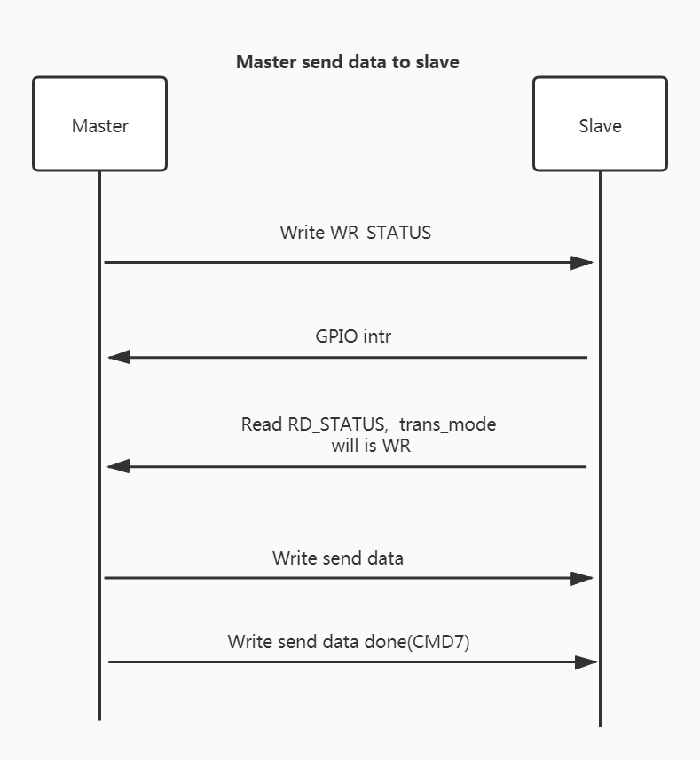
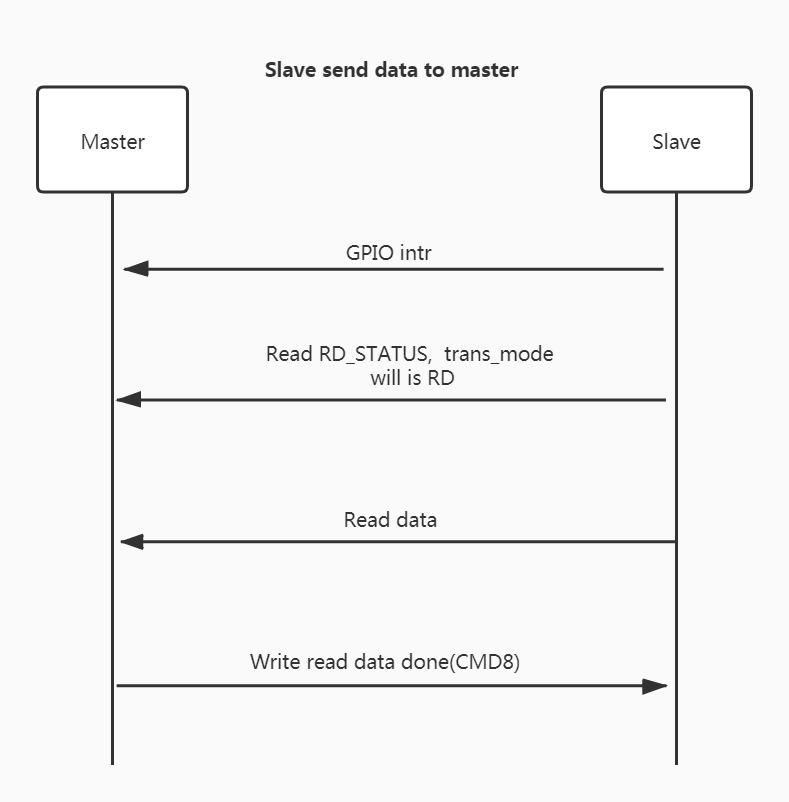

## 简介

ESP32-x series SPI VFS 是在 ESP32-x series （包含 ESP32-C 系列和 ESP32-S 系列，但不包括 ESP32）驱动接口的基础上封装了交互协议层，并对上层封装转换成标准的 POSIX 文件操作接口，可以满足各种应用下与 MCU 的高效数据传输。

## 硬件连接

| Signal      | Master(ESP32) | Slave(ESP32-C3) | Slave(ESP32-S2) |
| ----------- | ------------- | --------------- | --------------- |
| SCLK        | GPIO15        | GPIO6           | GPIO12          |
| MISO        | GPIO12        | GPIO2           | GPIO13          |
| MOSI        | GPIO13        | GPIO7           | GPIO11          |
| CS          | GPIO14        | GPIO10          | GPIO10          |
| HANDSHAKE   | GPIO5         | GPIO3           | GPIO5           |
| GND         | GND           | GND             | GND             |
| WP(4线模式) | GPIO16        | GPIO8           | GPIO16          |
| HD(4线模式) | GPIO17        | GPIO9           | GPIO17          |

**备注：**  

1. 4 线模式需要额外增加 WP 和 HD 两个管脚

## 传输协议

在传统的 SPI 通信中，因为所有线上传输都是 SPI master 主动的，所以 slave 一般只提供 SPI 读写接口即可。但在很多时候，slave 需要主动上报数据，这时就需要 slave 能够通过某种方式来通知 master 读取数据。在本方案中，封装的传输协议主要就是用来解决 SPI slave 和 master 之间相互同步的问题，进而实现双向实时通信的功能。

 ESP32-x series 内部有 72Bytes 的共享寄存器可供 SPI master 访问，在传输协议中使用了前 8 个字节用于传输控制。

- 前 4 个字节称为 `RD_STATUS`，对 SPI master 来说为只读寄存器，可以通过此寄存器获取数据长度、序列号和传输方向等状态信息 ；

- 后 4 个字节称为 `WR_STATUS`，对 SPI master 来说为只写寄存器，可以通过此寄存器将需要传输的序列号和数据长度告诉 SPI slave；

### MCU 发送数据给 ESP32-x series

#### MCU 主动发送的流程如下：

1. MCU 如果有数据需要发送，首先需要检测 SPI 是否正处于传输状态（避免同时发送），MCU 必须等待传输完成才能发起传输。
2. MCU 向 WR_STATUS 寄存器写入本次需要发送的序列号和数据长度，如果是第一包数据，则序列号为 1，否则需要根据上次的序列号自增，之后等待 GPIO 中断产生。
3. MCU 写 WR_STATUS 寄存器会触发 ESP32-x series 产生相应的事件， ESP32-x series 在监测到事件后，会将收到的序列号和数据长度原封不动的写入 RD 寄存器，并将传输方向标识为 WRITE，接着挂载对应长度的读取 buffer 到 SPI RX DMA，随后拉高 HANDSHAKE管脚通知 MCU。
4. MCU 在等到 GPIO 中断后，会先读取  RD_STATUS 寄存器，MCU 需要校验序列号和长度是否与之前写入的相同，通过判断其中的传输方向来决定发送还是接收数据。此时读到的传输方向是 WRITE。
5. MCU 发送对应长度的数据，并发送 CMD7 标识数据发送完成。

### ESP32-x series 发送数据给 MCU

ESP32-x series发送的流程与 MCU 发送的流程基本类似：

1. ESP32-x series 如果有数据需要发送，首先会检测 SPI 是否正处于传输状态（避免同时发送），ESP32-x series 会等待传输完成才能发起传输。
2. ESP32-x series 会先将需要发送的数据挂载到 SPI TX DMA，并向 RD 寄存器中写入本次需要发送的数据长度、序列号以及传输方向（此次为 READ），如果是第一包数据，则序列号为 1，否则需要根据上次的序列号自增。
3. ESP32-x series 拉管脚通知 MCU 取数据
4. MCU 在等到 GPIO 中断后，读取 RD_STATUS 寄存器中的数据长度信息和传输方向，确定此次传输方向为 READ，此时 MCU 还需要校验序列号否是保存的 ESP8266 发包的序列号加一。
5. MCU 发起 SPI 读数据传输，之后发送 CMD8 标识数据读取完成。

### Handshake 线的作用

在 ESP32-x series 将数据挂载对应的 DMA 上时，通过上拉 Handshake 管脚（MCU需要能监测并触发上升沿中断）可以控制 SPI 的传输节奏，避免 ESP32-x series 在未将数据挂载好时，MCU 发起了传输，从而导致数据丢失。其作用主要体现在如下方面：

- ESP32-x series 准备好发送数据
  - ESP32-x series 想要发送数据时，会先将 buffer 挂载到 DMA，然后将 Handshake 管脚拉高，MCU 在接收到 GPIO 中断信号后读取 RD_STATUS 寄存器，并检测其中传输方向为 RD ， MCU 才可以发起一次读数据传输。
- ESP32-x series 准备好接收数据
  - MCU 发送数据时，必须先向 WR_STATUS 写入长度信息，此时同样需要等待 ESP32-x series 将读取 buffer 挂载到 DMA，并拉 Handshake 管脚产生 GPIO 中断，MCU 在接收到中断信号后，判断 RD_STATUS 中的传输方向为 WR 才可以发起一次写数据传输。

### 包模式和流模式

ESP32 series 传输时支持两种数据类型：包模式（packet mode）和流模式（stream mode），其中：

1. 包模式以 item 方式实现，每次发送都会将上层需要发送的数据原封不动的传输，即使当前已经缓存多包数据，也不会组包发送，但需要注意的是，在包模式下，收到数据后，上层必须一次性取出这一包数据，即使上层需要的数据长度小于这一包的长度，底层也会返回这一包实际的长度，如果上层不做处理，则数据会出现丢失。
2. 流模式将缓冲起来的数据当成数据流，在 SPI 传输时会尽可能的把已经缓存的数据加载上去，缓存的数据可能是上层发的若干次数据。

包模式适用于需要保持原有 SPI 数据结构的场景，比如传输某些 WiFi 或者以太网数据包，组包将会导致数据无法发送。

流模式适用于需要对原有 SPI 数据结构加工的场景，数据将会缓冲起来，上层可以根据需要读取合适长度的数据。

如果 Master 连续发送了 3 包数据，长度分别为 1024， 2049，2049，那么在包模式下，将会按照上述长度分为 3 包发送；而在流模式下，如果缓冲区大小为 4096， 则可能只会发送两次，第一次发送的长度 3073（1024+2049），第二次发送的长度为 2049。

**备注：**

1. ESP32 series 模式的切换在 `./build.py menuconfig` --> `Component config` --> `VFS_DEV_BUS` --> `Data communicate way for SPI transmit`
2. 使用 ESP32 作为 SPI master 测试时可以在  `./build.py menuconfig` --> `Component config` --> `Driver platform Configuration`  --> `Data communicate way for SPI transmit  `选项中配置模式， 建议与 ESP32 series 配置成相同的模式（即如果 SPI master 采用流模式，那么 ESP32 series 同样采用流模式）。

### SPI 通信命令

MCU 在与 ESP32-x series 通信时采用半双工模式， MCU 通过使用不同的命令和地址表示读数据或者写数据。

在读写数据时，通信格式应为 1byte CMD + 1byte ADDR + 1byte DUMMY + 读/写最大 4092bytes 的 DATA 。

详细数据格式如下所示：

|            | Cmd（1byte） | Addr（1byte） | Dummy（1byte） | Data（Up to 4092bytes） |
| :--------: | :----------: | ------------- | -------------- | ----------------------- |
| Read data  |     0x4      | 0x0           | 0x0            | 实际长度的数据          |
| Write data |     0x3      | 0x0           | 0x0            | 实际长度的数据          |

在读写数据完成后，还需要传输读写完成标志才能进行下一次传输，读写完成标志的格式如下：

|            | Cmd（1byte） | Addr（1byte） | Dummy（1byte） |
| :--------: | :----------: | ------------- | -------------- |
| Read done  |     0x8      | 0x0           | 0x0            |
| Write done |     0x7      | 0x0           | 0x0            |

MCU 读写 RD_STATUS 和 WR_STATUS 寄存器的通信格式如下所示：

通信格式如下所示：

| 寄存器       | 命令（1byte） | 数据长度（4byte）                            |
| ------------ | ------------- | -------------------------------------------- |
| 读 RD_STATUS | 0x4           | MCU 读取 ESP32-x series 传输的长度和控制信息 |
| 写 WR_STATUS | 0x1           | MCU 写入长度和控制信息                       |

其中：

1. 命令在 MOSI 线上传输，而读 RD 寄存器时，数据长度在 MISO 线上传输。

**注意**：MCU 读写 status 不需要使用地址位，因此在 MCU 开发中需要将读写寄存器与读写数据区分开。

**WR_STATUS 寄存器**

WR_STATUS 寄存器接口结构如下所示：

| 长度区间（bit） | 31：24      | 23：16             | 15 ： 0                |
| --------------- | ----------- | ------------------ | ---------------------- |
| 含义            | Magic       | Send sequence      | Send len               |
| 说明            | 固定为 0xFE | MCU 每次发包时自增 | MCU 此次发包的字节长度 |

其中：

1. send sequence 每次 MCU 发包时需要自增，在 MCU 发第一包时 send sequence 为 1， 当超过 0xFF 时，下一包的  sequence 应该为 0。

**RD_STATUS 寄存器**

RD_STATUS 寄存器接口在传输中承担着协商通信的作用，因此其在 MCU 读数据和写数据时内容含义不同。

 RD_STATUS 寄存器接口结构如下所示：

| 长度区间（bit） | 31：24 | 23：16           | 15 ： 0            |
| --------------- | ------ | ---------------- | ------------------ |
| 含义            | Direct | Sequence number  | Transmit len       |
| MCU -> ESP      | WRITE  | MCU 发包的序列号 | MCU 发包的字节长度 |
| ESP -> MCU      | READ   | ESP 发包的序列号 | ESP 发包的字节长度 |

其中：

1. MCU 发送数据时，会先写 WR_STATUS， ESP32-x series会将收到的  sequence 和 len 写入  RD_STATUS，准备接收 buffer，并标识传输方向为 WRITE，MCU 需要在方向为 WRITE 时校验序列号是否和自己之前写入的一致，校验成功才可以发送数据。
2. ESP32-x series 发送数据时，同样会将自己发包的序列号和长度写入，标识方向为 READ。 序列号在每次 ESP32-x series 发包时自增，与 send sequence 一致，发送第一包时  sequence number 为 1，序列号为 0xFF 时，下一包序列号为 0。
3. Direct 值， READ 为 1， WRITE 为 2。

> 注意： MCU 发包序列号 和 ESP32-x series 发包序列号不可以混淆， MCU 需要同时保存这两个序列号

## 速率

ESP32 作为 MCU 充当 SPI master，运行在流模式下， CPU 跑在 240M， QIO 40M，streambuffer 设置为 8192。

ESP32-C3 作为 SPI slave，运行在流模式下，CPU 跑在 160M ， 应用程序每次发送 2048 bytes，streambuffer 设置为 8192。

测试版本： v4.3-beta1, commit: 52f1f68dc

测试不同 SPI 时钟的速率如下所示:

| Clock | Mode     | Master -> Slave | Slave -> Master |
| ----- | -------- | --------------- | --------------- |
| 10M   | Standard | 8.7Mbps         | 8.8Mbps         |
| 10M   | Dual     | 16.1Mbps        | 16.4Mbps        |
| 10M   | Quad     | 27.8Mbps        | 28.9Mbps        |
| 20M   | Standard | 16.2Mbps        | 16.5Mbps        |
| 20M   | Dual     | 28.0Mbps        | 29.1Mbps        |
| 20M   | Quad     | 44.4Mbps        | 47.2Mbps        |
| 40M   | Standard | 28.1Mbps        | 29.2Mbps        |
| 40M   | Dual     | 44.6Mbps        | 47.4Mbps        |
| 40M   | Quad     | 57.6Mbps        | 68.8Mbps        |

备注：

1. 在 ESP32 作为 SPI master 进行高速传输（速率超过 20M）时，不可以使用 gpio_matrix 选择其他管脚通信，否则会出现数据偏移的问题。
