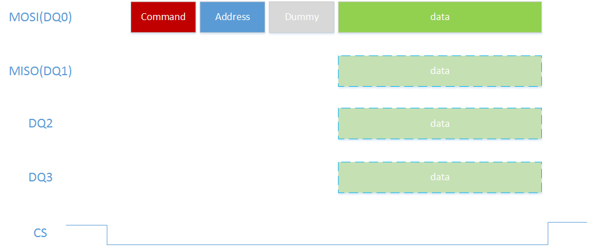

ESP 芯片多线 SPI 使用介绍

## 简介

SPI （Serial Peripheral Interface）是 Motorala 开发的一种短距离同步串行通信接口。SPI 设备通过  单 master 多 slave 结构进行通信， 通信总是由 SPI master 设备发起，不同的 slave 设备通过不同的片选信号线（CS，也称为从机选择 SS）进行控制。本文主要专注于对多线 SPI 的描述，可以涉及一些基本的一些 SPI 结构，但不会对 SPI 协议进行深入分析。

## SPI 线序结构

### 全双工

全双工 SPI 即标准的 SPI 结构，由 SCLK，MOSI，MISO 以及 CS 4 跟线组成，在 master 通过 MOSI 线发送数据的同时， slave 同样通过 MISO 线发送数据。CS 线处于低电平时传输数据。

而如果是一个 master 对应多个 slave，则需要不同 CS 线进行控制， ESP 芯片上典型的就是作为 SPI master 同时与 PSRAM 和 FLASH 进行通信，只需要多出一个 CS 线即可，多个 slave 从机需要保证同一时刻只能有一个 CS 线处于低电平状态。

### 半双工

在半双工模式，同一时刻只会进行单向传输。

### Standard SPI

在标准 SPI 中配置为半双工模式，即可使用半双工通信，同样使用标准 SPI 中的 4 根线，但同一时刻只有一根线在传输数据，即 SPI master 或者通过 MOSI 发送数据，或者通过 MISO 接受数据。

此时还可以将 MOSI 和 MISO 线进行合并，从而实现 3 根线进行 SPI 数据传输。

### Dual SPI

因为很多时候数据传输都是单向的，在 4 线的半双工明显存在浪费的情况，因此后面出现 Dual SPI，也就是 2 线模式，这种模式只能处于半双工状态下，将 MOSI 和 MISO 两根线复用，MOSI 线变成 DQ0 携带偶数位，MISO 线变成 DQ1 携带奇数位，同时进行单向数据的收发，这样传输效率变成了标准 SPI 的两倍。

### Quad SPI

Quad SPI 在 dual SPI 的基础上又增加了两个 IO 线 DQ2 和 DQ3 （在 ESP 设备中称为 WP 线和 HD 线），每个时钟周期发送 4 个数据位。

### 传输方式对比

以 SPI master 读写字节数据为例，在全双工模式，可以同时进行字节数据的读和写，而在 3 线的标准 SPI 下，只能先写数据，然后再去读。

而在 dual SPI 中， MOSI 和  MISO 同时传输数据，其中 MOSI(DQ0) 线传输 BIT0，2，4，6；MISO(DQ1) 线传输 BIT1，3，5，7。在 quad SPI 中，数据将会平均分布到 4 根线上，其中 DQ0 传输  BIT0 和 BIT4， DQ1 传输 BIT1 和 BIT5；DQ2 传输 BIT2 和 BIT6；DQ3 传输 BIT3 和 BIT7。如下图所示：

看不清楚请点击链接看大图： https://www.byteparadigm.com/pictures/SPIStormStandardProtocols_Full.png

## ESP 设备对多线 SPI 的支持

### 支持模式

当前已有的 ESP 设备作为 SPI slave 对于多线 SPI 的支持如下：

| 型号     | 最大时钟频率（MHz） | dual SPI | quad SPI |
| -------- | ------------------- | -------- | -------- |
| ESP8266  | 20                  | YES      | NO       |
| ESP32    | 10                  | YES      | YES      |
| ESP32-S2 | 40                  | YES      | YES      |
| ESP32-C3 | 60                  | YES      | YES      |

未来拓展的新 ESP 设备作为 SPI slave 同样会支持 dual SPI 和 quad SPI 模式。

### 使用方法

ESP 设备作为 SPI slave 在使用多线 SPI 时，支持如下两种模式：

- Command 在单线上（MOSI），而 data 和 Address 多线传输
- Command 和 Address 在单线，而 data 在多线传输

在使用上， ESP8266 和 ESP32 series 存在一些区别

**ESP32 series**

对于 ESP32 series，只需要在初始化 SPI BUS 时将 flags 中的 [SPI_COMMON_BUSFLAG_DUAL](https://github.com/espressif/esp-idf/blob/master/components/driver/include/driver/spi_common.h#L69) 置位即代表可以使用 dual SPI 模式。而如果使用 qual SPI 模式，需要使能  [SPICOMMON_BUSFLAG_QUAD](https://github.com/espressif/esp-idf/blob/master/components/driver/include/driver/spi_common.h#L71)。

**ESP8266**

对于 ESP8266 的 dual SPI，如果需要使用第一种方式，需要使能寄存器  SPI1.ctrl.fread_dio 和 SPI1.user.fread_dio；

如果使用第二种方式，需要使能寄存器 SPI1.ctrl.fread_dual 和 SPI1.user.fwrite_dual。

目前 `esp-vfs-dev-bus` 项目使用的是第二种方式，只有 data 使用多线传输，接下来默认会以此方式来说明。

## 通信方式

### 数据格式

 MCU 与 ESP 设备收发数据需要遵循的数据格式如下：

在半双工模式，发送数据需要采用  Command + Address + Dummy（在 ESP8266 上不需要） + data 的方式，其中  Command， Address 和 Dummy（在 ESP8266 上不需要） 数据**只在** MOSI 线上传输，而 Data 数据可以根据 SPI 模式的配置在不同的线序上同时传输，例如使用 Dual SPI 模式传输时，data 将会在 DQ0 和 DQ1 线上传输。

### 读写命令

对于 ESP 设备，MCU 通过使用不同的命令表示读数据或者写数据。数据传输格式如下所示：

**ESP8266**

MCU 跟 ESP8266 SPI 收发数据循序的格式为 1byte  Command + 1byte  Address + 最大 64 字节的数据。

需要注意跟 ESP8266 不需要 Dummy 字段，而且最长只支持 64 字节，这是因为 ESP8266 SPI 并没有 DMA，只能将数据写入其 FIFO 中。

|       | Command（1byte） | Address（1byte） | Data（1~64byte） |
| :---: | :--------------: | ---------------- | ---------------- |
| Read  |       0x3        | 0x0              | 实际长度         |
| Write |       0x2        | 0x0              | 实际长度         |

**ESP32 series**

MCU 在与 ESP32 series （包括 ESP32-S系列和  ESP32-C 系列）通信时，读写格式应为 1byte Command + 1byte Address + 1byte DUMMY + 读/写最大 4092bytes 的 DATA 。

详细数据格式如下所示：

|       | Command（1byte） | Address（1byte） | Dummy（1byte） | Data（Up to 4092bytes） |
| :---: | :--------------: | ---------------- | -------------- | ----------------------- |
| Read  |       0x4        | 0x0              | 0x0            | 实际长度                |
| Write |       0x3        | 0x0              | 0x0            | 实际长度                |

在读写数据完成后，还需要传输读写完成标志才能进行下一次传输，读写完成标志的格式如下：

|            | Command（1byte） | Address（1byte） | Dummy（1byte） |
| :--------: | :--------------: | ---------------- | -------------- |
| Read done  |       0x8        | 0x0              | 0x0            |
| Write done |       0x7        | 0x0              | 0x0            |

读写完成标志不会做数据传输，只在 MOSI 线上传输。

### 共享寄存器的操作

> 读写共享寄存器无法使用  dual 和 quad 模式，只会使用  standard 模式，即只在 MOSI 或者 MISO 线上传输

ESP 设备有多个共享寄存器可供 SPI master 操作，用以同步一些控制信息（比如传输数据长度），通过读写共享寄存器，可以在 SPI 上实现更复杂的通信。

**ESP8266**

ESP8266 有两个 MCU 可访问的 32bit 寄存器（status）， 其中一个 MCU 可写（WR 寄存器），ESP8266 可读；另外一个是 MCU 可读（RD 寄存器），ESP8266 可写。MCU 通过读写这两个 status 寄存器，以此实现传递数据长度信息。

通信格式如下所示：

|              | Command（1byte） | Data（4byte）               |
| :----------: | :--------------: | --------------------------- |
| Read Status  |       0x4        | MCU 读取 ESP8266 写入的数据 |
| Write Status |       0x1        | MCU 可写的数据              |

需要注意的是，**MCU 读写 status 不需要使用地址位**，因此在 MCU 开发中需要将读写 status 与读写数据区分开。

**ESP32 series**

ESP32 series 有 72Bytes 的共享寄存器，通过访问不同的 Address 可以实现不同寄存器的读写。最大写入的数据长度为  72 - Address 字节。

通信格式如下所示：

|              | Command（1byte） | Address(1byte) | Dummy(1byte) | Data（Up to (72 - Address )byte） |
| ------------ | ---------------- | -------------- | ------------ | --------------------------------- |
| Read Status  | 0x2              | 0x0 ~ 0x48     | 0x0          | MCU 读取 slave 传输的数据         |
| Write Status | 0x1              | 0x0 ~ 0x48     | 0x0          | MCU 可写的数据                    |

具体使用方式可以参考  `esp-vfs-dev-bus` 项目。

## 速率

以下测试均基于  `esp-vfs-dev-bus` 项目， 因为需要考虑同时收发的场景以及数据的缓冲，所以在上层还封装了一层用户协议；如果单纯使用驱动接口，速率会有更大的提升。

### ESP8266

使用 ESP32 作为 MCU， GPIO 中断与 SPI 传输放置在不同的 TASK， 测试吞吐率结果如下：

| SPI  时钟 | 模式     | master -> slave | slave -> master   |
| --------- | -------- | --------------- | ----------------- |
| 20M       | Standard | 1096KB/s        | NA (读寄存器错误) |
| 20M       | Dual     | 1500KB/s        | 1567KB/s          |
| 15M       | Standard | 973KB/s         | 1028KB/s          |
| 15M       | Dual     | 1324KB/s        | 1442KB/s          |
| 10M       | Standard | 756KB/s         | 776KB/s           |
| 10M       | Dual     | 1080KB/s        | 1166KB/s          |

**备注：**

- ESP8266 一次只能发送 64 字节

### ESP32 series

ESP32 作为 MCU 充当 SPI master， CPU 跑在 240M， QIO 40M。

ESP32-C3 作为 SPI slave，CPU 跑在 160M ， 每次发送 4092bytes。测试不同 SPI 时钟的速率如下所示:

| 时钟 | 模式     | TX        | RX        |
| ---- | -------- | --------- | --------- |
| 10M  | Standard | 8.75Mbps  | 8.78Mbps  |
| 10M  | Dual     | 16.14Mbps | 16.26Mbps |
| 10M  | Quad     | 28.04Mbps | 28.43Mbps |
| 20M  | Standard | 16.22Mbps | 16.3Mbps  |
| 20M  | Dual     | 28.25Mbps | 28.48Mbps |
| 20M  | Quad     | 44.76Mbps | 45.45Mbps |
| 40M  | Standard | 28.4Mbps  | 28.79Mbps |
| 40M  | Dual     | 45.18Mbps | 46.15Mbps |
| 40M  | Quad     | 62.2Mbps  | 66.29Mbps |

**备注：**

- 在 ESP32 作为 SPI master 进行高速传输（速率超过 20M）时，不可以使用 gpio_matrix 选择其他管脚通信，否则会出现数据偏移的问题。

## 扩展

1. 关于 flash 配置项中的 DIO/DOUT/QIO/QOUT 模式。

   DIO 即 Dual I/O Fast Read， 地址和数据都可以通过两线来读。

   DOUT 即 Dual Output Fast Read， 也就是只有数据是通过两线读取，地址依然通过 MOSI 单线传输，所以 DOUT 模式比 DIO 稍微慢一些。

   QIO 和 QOUT 与之类似 ，只是采用了 4 线方式，不同的配置跟 flash 具体的设计有关，更多介绍可以参考 Augus 的一个[回复](https://www.esp32.com/viewtopic.php?t=1250)。 